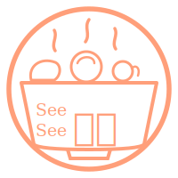

<div align="center">



# 美食大作战

**今天吃什么？让塔罗帮你选 ✦**

早午餐咖啡馆菜单 × 网易云评论区 × 少女心塔罗  
温暖治愈、食欲感强，一点点神秘但不黑暗。

<br/>

[](https://gaowei90098-creator.github.io/meishi-dazuozhan/)

<br/>

</div>

---

## ✨ 功能

- 🎭 **选心情** — 从 5 种情绪里选一个，塔罗要看菜下碟
- 🃏 **抽牌** — 随机抽取 3 张塔罗牌
- 🍜 **看结果** — 根据牌面给出今日美食推荐 + 幽默解读

## 🎨 设计风格

| 主色 | 辅色 | 背景 |
|------|------|------|
| 暖橘 `#FF9F7A` | 薄荷 `#7AB8A5` | 奶白 `#FFF8F0` |

## 🚀 本地运行

```bash
# 任意 HTTP 服务器均可，例如：
python3 -m http.server 3456
# 然后打开 http://localhost:3456
```

## 📁 项目结构

```
├── index.html          # 主文件（含全部逻辑）
├── assets/
│   ├── logo.svg        # See See 吃啥 logo
│   └── moods/          # 情绪图片
├── components/         # JSX 组件（参考用）
└── design-tokens.css   # 设计变量
```
